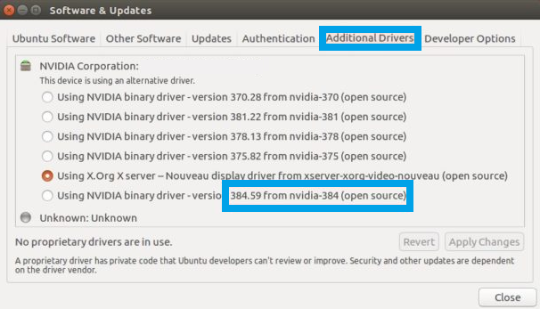
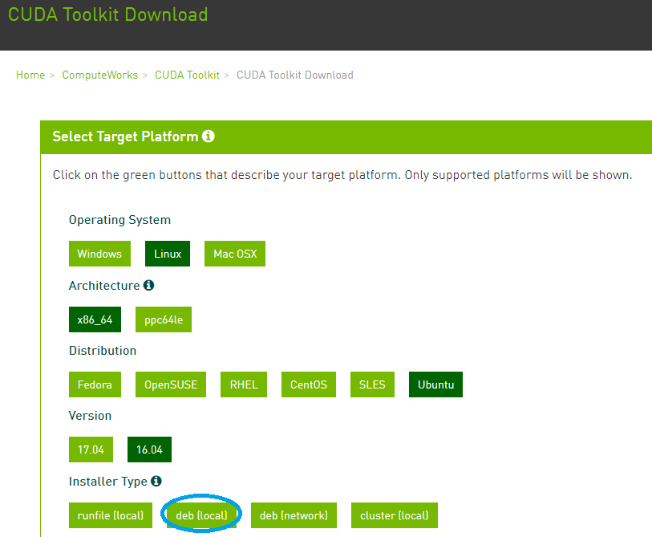

# CryptoMining # Useful tools for Crypto Mining in Ubuntu
https://github.com/baldersd/CryptoMining

<h1>Description</h1>
<strong>Useful Build Scripts for NVIDIA rigs</strong>
<pre>
This assumes that you have already booted into Ubuntu MATE (vanilla).
This article is written against version ubuntu-mate-16.04.3-desktop-amd64.iso (1.60 GB (1,728,053,248 bytes)).
~If you need help burning the ISO to a USB/HDD try Rufus: https://rufus.akeo.ie/.~
</pre>

<h1>-BUILD STEPS-</h1>
<h2>Step 1. Install latest NVIDIA drivers</h2>
See <strong>updatenvidia.sh</strong> but essentially as sudo just run:
<pre>
apt-get update
add-apt-repository -y "ppa:graphics-drivers/ppa"
</pre>
Should look something like this screenshot:

After running this (may need to reboot) you should see the latest driver is detected in the DRIVERS applet.

Switch to this one and reboot again.

<pre>
To install a specific version this should also work "sudo apt-get install nvidia-384" (untested)
</pre>
<h2>Step 2. Open NVIDIA-SETTIGS applet and review</h2>
<pre>
You want to make sure all your cards are detected this will show quickly. 
Alternatively run "nvidia-smi" from shell.
</pre>
<strong>MAKE A NOTE OF EACH GPU(X) ASSIGNMENT.</strong>

You need these #'s for your overclock file.

<h2>Step 3. Install pre-requisite libraries and key environment stuff</h2>
<h3>SSH for remote access</h3>
<pre>
apt-get update && apt-get install -y openssh-server
cp -a /etc/ssh/sshd_config /etc/ssh/sshd_config_backup
rm -rf /etc/ssh/sshd_config
touch /etc/ssh/sshd_config
echo "Port 22" >> /etc/ssh/sshd_config
echo "Protocol 2" >> /etc/ssh/sshd_config
echo "HostKey /etc/ssh/ssh_host_rsa_key" >> /etc/ssh/sshd_config
echo "HostKey /etc/ssh/ssh_host_dsa_key" >> /etc/ssh/sshd_config
echo "HostKey /etc/ssh/ssh_host_ecdsa_key" >> /etc/ssh/sshd_config
echo "HostKey /etc/ssh/ssh_host_ed25519_key" >> /etc/ssh/sshd_config
echo "UsePrivilegeSeparation yes" >> /etc/ssh/sshd_config
echo "KeyRegenerationInterval 3600" >> /etc/ssh/sshd_config
echo "ServerKeyBits 2048" >> /etc/ssh/sshd_config
echo "KeyRegenerationInterval 3600" >> /etc/ssh/sshd_config
echo "SyslogFacility AUTH" >> /etc/ssh/sshd_config
echo "LogLevel INFO" >> /etc/ssh/sshd_config
echo "LoginGraceTime 120" >> /etc/ssh/sshd_config
echo "PermitRootLogin yes" >> /etc/ssh/sshd_config
echo "StrictModes yes" >> /etc/ssh/sshd_config
echo "RSAAuthentication yes" >> /etc/ssh/sshd_config
echo "PubkeyAuthentication yes" >> /etc/ssh/sshd_config
echo "PermitRootLogin yes" >> /etc/ssh/sshd_config
echo "IgnoreRhosts yes" >> /etc/ssh/sshd_config
echo "RhostsRSAAuthentication no" >> /etc/ssh/sshd_config
echo "HostbasedAuthentication no" >> /etc/ssh/sshd_config
echo "PermitEmptyPasswords no" >> /etc/ssh/sshd_config
echo "ChallengeResponseAuthentication no" >> /etc/ssh/sshd_config
echo "X11Forwarding no" >> /etc/ssh/sshd_config
echo "AllowTcpForwarding no" >> /etc/ssh/sshd_config
echo "X11DisplayOffset 10" >> /etc/ssh/sshd_config
echo "PrintMotd no" >> /etc/ssh/sshd_config
echo "PrintLastLog yes" >> /etc/ssh/sshd_config
echo "TCPKeepAlive yes" >> /etc/ssh/sshd_config
echo "AcceptEnv LANG LC_*" >> /etc/ssh/sshd_config
echo "Subsystem sftp /usr/lib/openssh/sftp-server" >> /etc/ssh/sshd_config
echo "UsePAM yes" >> /etc/ssh/sshd_config
service ssh restart
</pre>
<h3>Disable IPv6</h3>
<pre>
echo "net.ipv6.conf.all.disable_ipv6 = 1" >> /etc/sysctl.conf
echo "net.ipv6.conf.default.disable_ipv6 = 1" >> /etc/sysctl.conf
echo "net.ipv6.conf.lo.disable_ipv6 = 1" >> /etc/sysctl.conf
/sbin/sysctl -p
</pre>
<h3>Install common libs used by various miner programs</h3>
<pre>
apt-get update && apt-get install -y software-properties-common automake autoconf pkg-config libcurl4-openssl-dev libjansson-dev libssl-dev libgmp-dev git make g++
apt-get autoremove
apt-get clean
</pre>
<h2>Step 4. Install NVIDIA CUDA binaries</h2>

https://developer.nvidia.com/cuda-downloads

<i>In this case I used 16.04 version</i>

<pre>
<strong>Installation Instructions:</strong>
wget https://developer.nvidia.com/compute/cuda/9.0/Prod/local_installers/cuda-repo-ubuntu1604-9-0-local_9.0.176-1_amd64-deb
sudo dpkg -i cuda-repo-ubuntu1604-9-0-local_9.0.176-1_amd64-deb
sudo apt-key add /var/cuda-repo-<version>/7fa2af80.pub
sudo apt-get update
sudo apt-get install cuda
</pre>
<h2>Step 5. Setup Over-clocking</h2>

coming...

<h2>Step 6. Setup Mining software and connect to a pool</h2>

coming...

