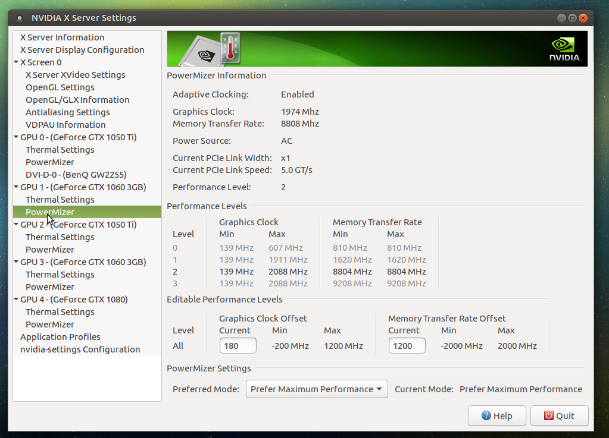

# CryptoMining # Useful tools for Crypto Mining in Ubuntu
https://github.com/baldersd/CryptoMining

<h1>Description</h1>
<strong>Useful Build Scripts for NVIDIA rigs</strong>
<pre>
This assumes that you have already booted into Ubuntu MATE (vanilla).
This article is written against version ubuntu-mate-16.04.3-desktop-amd64.iso (1.60 GB (1,728,053,248 bytes)).
~If you need help burning the ISO to a USB/HDD try Rufus: https://rufus.akeo.ie/.~
</pre>

<h1>-BUILD STEPS-</h1>
<h2>Step 1. Install latest NVIDIA drivers</h2>
See <strong>updatenvidia.sh</strong> but essentially as sudo just run:
<pre>
apt-get update
add-apt-repository -y "ppa:graphics-drivers/ppa"
</pre>
Should look something like this screenshot:

After running this (may need to reboot) you should see the latest driver is detected in the DRIVERS applet.

Switch to this one, hit "APPLY CHANGES" and reboot again.

<pre>
To install a specific version this should also work "sudo apt-get install nvidia-384" (untested)
</pre>
<h2>Step 2. Open NVIDIA-SETTINGS applet and review</h2>

<pre>
You want to make sure all your cards are detected this will show quickly. 
Alternatively run "nvidia-smi" from shell.
</pre>

<strong>MAKE A NOTE OF EACH GPU(X) ASSIGNMENT.</strong>

You need these #'s for your overclock file.

<i>Please Note -- the GPU numbering here isn't necessarily in the same ordering as what the miner program sets.</i>

<h2>Step 3. Install pre-requisite libraries and key environment stuff</h2>
<h3>SSH for remote access</h3>
<pre>
apt-get update && apt-get install -y openssh-server
cp -a /etc/ssh/sshd_config /etc/ssh/sshd_config_backup
rm -rf /etc/ssh/sshd_config
touch /etc/ssh/sshd_config
echo "Port 22" >> /etc/ssh/sshd_config
echo "Protocol 2" >> /etc/ssh/sshd_config
echo "HostKey /etc/ssh/ssh_host_rsa_key" >> /etc/ssh/sshd_config
echo "HostKey /etc/ssh/ssh_host_dsa_key" >> /etc/ssh/sshd_config
echo "HostKey /etc/ssh/ssh_host_ecdsa_key" >> /etc/ssh/sshd_config
echo "HostKey /etc/ssh/ssh_host_ed25519_key" >> /etc/ssh/sshd_config
echo "UsePrivilegeSeparation yes" >> /etc/ssh/sshd_config
echo "KeyRegenerationInterval 3600" >> /etc/ssh/sshd_config
echo "ServerKeyBits 2048" >> /etc/ssh/sshd_config
echo "KeyRegenerationInterval 3600" >> /etc/ssh/sshd_config
echo "SyslogFacility AUTH" >> /etc/ssh/sshd_config
echo "LogLevel INFO" >> /etc/ssh/sshd_config
echo "LoginGraceTime 120" >> /etc/ssh/sshd_config
echo "PermitRootLogin yes" >> /etc/ssh/sshd_config
echo "StrictModes yes" >> /etc/ssh/sshd_config
echo "RSAAuthentication yes" >> /etc/ssh/sshd_config
echo "PubkeyAuthentication yes" >> /etc/ssh/sshd_config
echo "PermitRootLogin yes" >> /etc/ssh/sshd_config
echo "IgnoreRhosts yes" >> /etc/ssh/sshd_config
echo "RhostsRSAAuthentication no" >> /etc/ssh/sshd_config
echo "HostbasedAuthentication no" >> /etc/ssh/sshd_config
echo "PermitEmptyPasswords no" >> /etc/ssh/sshd_config
echo "ChallengeResponseAuthentication no" >> /etc/ssh/sshd_config
echo "X11Forwarding no" >> /etc/ssh/sshd_config
echo "AllowTcpForwarding no" >> /etc/ssh/sshd_config
echo "X11DisplayOffset 10" >> /etc/ssh/sshd_config
echo "PrintMotd no" >> /etc/ssh/sshd_config
echo "PrintLastLog yes" >> /etc/ssh/sshd_config
echo "TCPKeepAlive yes" >> /etc/ssh/sshd_config
echo "AcceptEnv LANG LC_*" >> /etc/ssh/sshd_config
echo "Subsystem sftp /usr/lib/openssh/sftp-server" >> /etc/ssh/sshd_config
echo "UsePAM yes" >> /etc/ssh/sshd_config
service ssh restart
</pre>
<h3>Disable IPv6</h3>
<pre>
echo "net.ipv6.conf.all.disable_ipv6 = 1" >> /etc/sysctl.conf
echo "net.ipv6.conf.default.disable_ipv6 = 1" >> /etc/sysctl.conf
echo "net.ipv6.conf.lo.disable_ipv6 = 1" >> /etc/sysctl.conf
/sbin/sysctl -p
</pre>
<h3>Install common libs used by various miner programs</h3>
<pre>
apt-get update && apt-get install -y software-properties-common automake autoconf pkg-config libcurl4-openssl-dev libjansson-dev libssl-dev libgmp-dev git make g++
apt-get autoremove
apt-get clean
</pre>
<h2>Step 4. Install NVIDIA CUDA binaries</h2>

https://developer.nvidia.com/cuda-downloads

<i>In this case I used 16.04 version</i>

<pre>
<strong>Installation Instructions:</strong>
wget https://developer.nvidia.com/compute/cuda/9.0/Prod/local_installers/cuda-repo-ubuntu1604-9-0-local_9.0.176-1_amd64-deb
sudo dpkg -i cuda-repo-ubuntu1604-9-0-local_9.0.176-1_amd64-deb
sudo apt-key add /var/cuda-repo-<version>/7fa2af80.pub
sudo apt-get update
sudo apt-get install cuda
</pre>
<h2>Step 5. Setup Over-clocking</h2>

Take a look at my overclock.sh file >> on my <a href="https://github.com/baldersd/CryptoMining/tree/master/Miner%20Scripts" target="_new">Miner Scripts</a> page  Direct: <a href="https://github.com/baldersd/CryptoMining/blob/master/Miner%20Scripts/overclock.sh" target="_new">overclock.sh</a>

<strong>Here's a quick example for Power;Core OC; Memory OC & Fan control for a single GPU (GPU0):</strong>

<pre>
"nvidia-smi -pm 1" --- sets persistent mode
"nvidia-smi -i 0 -pl 70" --- sets GPU0's power draw to a 70 limit.
"nvidia-settings -c :0 -a '[gpu:0]/GPUMemoryTransferRateOffset[2]=1400'" --- sets the Memory overclock +1400
"nvidia-settings -c :0 -a '[gpu:0]/GPUGraphicsClockOffset[2]=170'" --- sets the Core overclock +170
"nvidia-settings -a [gpu:0]/GPUFanControlState=1 -a [fan:0]/GPUTargetFanSpeed=70 -c :0.0" --- enables manual fan control and sets the RPM to 70%.
</pre>

Note the fan line - the <i>-c :0.0</i> is mandatory it means the X-server display.

Also note <i>ClockOffset[2]</i> + <i>TransferRateOffset[2]</i> -- the <i>[2]</i> bit --- this is the performance mode the card is highest capable of which you should be able to see in "nvidia-smi" or more easily in the NVIDIA-SETTINGS applet.

<h2>Step 6. Setup Mining software and connect to a pool</h2>

There are quite a few miner programs out there for all the different algos that have surfaced - as I prefer to mine ZEC here is a quick quide to EWBF miner but most mining pools will give you all you need to know to configure the other miner programs.

<h3>EWBF</h3>

Note - I use the Flypool Zcash mining pool for my rig which uses port 3333 --- https://zcash.flypool.org

Download link to <a href="https://bitcointalk.org/index.php?topic=1707546.0" target="_new">EWBF's CUDA Zcash miner</a>

Latest (as of writing) is Version 0.3.4b -- now comes with a mini web client (api) for stats --  http://127.0.0.1:42000/getstat 

<pre>
Just download the Linux version tarball and extract to a folder of your choice.
Using nano or vi edit the miner.cfg file to reflect your pool settings and user/worker account or wallet:  
Set "cuda_devices" to equal the number of cards in your rig starting with 0.
I have 5 cards so mine would be set to 0 1 2 3 4.  
I didn't see any reason to lower the intensity from the MAX setting of 64.  
Set eexit to 1 --- this is meant to turn on some built-in crash protection (not sure its much good mind you).
(I have created an external script to address crashes and reboots -- see the <a href="https://github.com/baldersd/CryptoMining/tree/master/Miner%20Scripts" target="_new">Miner Scripts</a> page.  
Set the log level to 2 so you can capture decent diagnostics (primarily for the health checker script's benefit).  
API is the address and port number that you want the mini website for stats to run under.  
You can set secondary pool servers for failover. I have set one additional pool server if EU one goes down.  
<strong>[Example miner.cfg]</strong>
[common]
cuda_devices 0 1 2 3 4
intensity    64 64 64 64 64
templimit    83
pec          0
boff         0
eexit        1
tempunits    c
log          2
logfile      miner.log
api          192.168.1.88:42000

[server]
server eu1-zcash.flypool.org
port   3333
user   t1LpQmsa3oa3W1B8B4rzKRB7kpKPkXf1Mbi.rig1/baldersd@hotmail.com
pass   x

[server]
server us1-zcash.flypool.org
port   3333
user   t1LpQmsa3oa3W1B8B4rzKRB7kpKPkXf1Mbi.rig1/baldersd@hotmail.com
pass   x
</pre>

<h2>Step 8. Test run the miner and move on to "Mining Scripts" page.</h2>
<strong>Always allow at least 30minutes of mining for any kind of accurate stats to show in the mining pool dashboard (some take longer)</strong>

<h2>Step 7. (Optional) Install TMUX</h2>
<pre>
tmux — terminal multiplexer enables a number of terminals to be
     created, accessed, and controlled from a single screen.  tmux may be
     detached from a screen and continue running in the background, then later
     reattached. 
 --> Really useful for dealing with miner software in your rig remotely with PuTTY and via CRON.
 </pre>
<h3>to install tmux:</h3>

sudo apt-get install tmux

