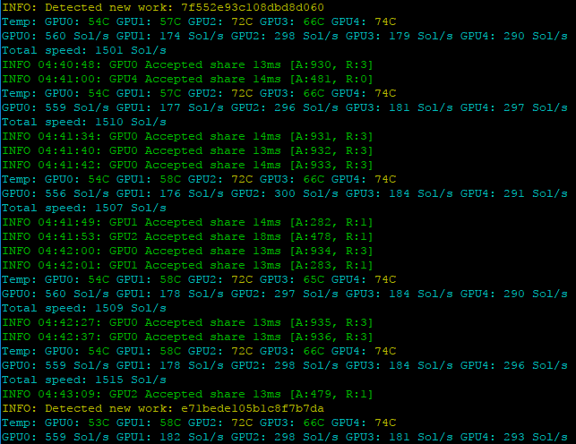
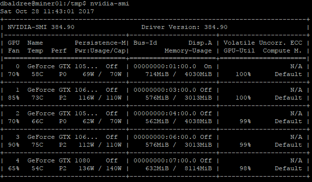

<h1>Useful scripts for manipulating miner program</h1>
<pre>Please note this was designed for use with EWBF miner but should be pretty easy to adapt for other miners like Claymore</pre>
<h2>*** New updates ***</h2>
<pre>31/12/2017 | Running X (nvidia-settings) remotely 
sudo DISPLAY=:0 XAUTHORITY=/var/run/lightdm/root/:0 <command>
(e.g. sudo DISPLAY=:0 XAUTHORITY=/var/run/lightdm/root/:0 nvidia-settings -t -q GPUUtilization)
(e.g. sudo DISPLAY=:0 XAUTHORITY=/var/run/lightdm/root/:0 ./myoverclock.sh)
</pre>
<pre>18/12/2017 | Added multi-miner (ccminer multiple blends) health-checking and startup:
(So you can use different compilations of ccminer for better hash rates on certain algs)
----------------------Uses a txt file for specifying CCMINER or MINER (EWBF)
----------------------Uses a txt file for specifying ALGO to mine.
dbaldree@miner01:~/Desktop/$ cat whatminer
<strong>ccminer</strong>
dbaldree@miner01:~/Desktop/$ cat whatalg
<strong>SIB</strong>
</pre>
<h2>Health check scripts</h2>

Tip! These scripts make use of the SYSLOG service so you could put in some additional monitoring on /var/log/syslog

<ul>
<li><strong>healthcheck.sh</strong> -- this reads the tail of the EWBF Miner or CCMINER log -- looks for the common fault codes and terminates the tmux session on finding a fault**</li>
<li><strong>ipmailme.sh</strong> -- uses POSTFIX to send an email message when PUBLIC IP changes (Uses a CURL request to obtain current IP and compares with the previous one which is stored in a file locally)</li>
<li><strong>startmining.sh</strong> -- contains the TMUX code to launch the miner and also monitors the process so we can restart it if it crashes.</li>
<li><strong>tmuxkill.sh</strong> -- (optional file) -- hard stops the miner software (actual kills the tmux session) on demand.</li>
</ul>

  ** the startmining.sh file polls for the miner process so will autorestart it if it is terminated by the health checker.

<pre>
Also if anyone can see a better way of doing this or can see opportunities to improve these health check scripts please do shout me out (baldersd@hotmail.com).
</pre>

<h2>Crontab Jobs</h2>
<ul>
<li>cron.txt -- use the lines within in your cron file (run "crontab -e" but under your account not sudo/root)</li>
</ul>

This will execute the tasks (healthcheck scripts above) constantly:

<ul>
  <li>Start your miner program in a TMUX terminal.</li>
  <li>Start your miner program in a TMUX terminal straight away on a reboot.</li>
  <li>If your public IP changes email someone! (requires POSTFIX).</li>
  <li>If miner program crashes restart it.</li>
  </ul>
  
Be sure to change the path to your download folder location.

<h2>Over-clocking</h2>
<ul>
  <li><a href="https://github.com/baldersd/CryptoMining/blob/master/Miner%20Scripts/overclock.sh" target="_new">overclock.sh</a></li>
  
You will need to edit this file a whole heap of times to find your optimal O/C settings.

  <pre>--Be prepared to spend some hours on this--</pre>
  
<strong>This is my O/C balance for the three different cards in my 1st rig I setup.  Mining ZCASH (ZEC) with these settings on average I get: 
    -- 560 Sol/s GPU0 (1080) 
    -- 180 Sol/s GPU1 & 3 (1050TI) 
    -- 300 Sol/s GPU2 & 4 (1060)  
    +1500Sol/s total across the 5 cards.
    </strong>

  
</ul>

<h2>Using TMUX</h2>
1. Have a look at the <a href="https://github.com/baldersd/CryptoMining/blob/master/Miner%20Scripts/startmining.sh" target="_new">startmining.sh</a> file as it will explain how the session works. You can also check out the <a href="https://linux.die.net/man/1/tmux" target="_new">man pages</a> for tmux. 
2. Once TMUX is started and the miner app started within - you will not see anything on screen yet (as it runs in background). 
3. Run "tmux attach" to connect to that session. 
4. You can close the terminal window anytime it will remain running. 
5. If you need to terminate your miner program manually see the tmuxkill.sh file. 
<h3>to install tmux:</h3>
<pre>sudo apt-get install tmux</pre>

<h2>Postfix example config (main.cf)</h2>

In my case I've chosen to use SAML authentication to allow secure relay through the SENDGRID service

<pre>
Install POSTFIX:  apt-get install postfix
Find your Postfix config file, typically /etc/postfix/main.cf
</pre>

<pre>
Install SAML support:  apt-get install libsasl2-modules
Set the API and password for SENDGRID. >> https://sendgrid.com/docs/Integrate/Mail_Servers/postfix.html
</pre>

$ cat main.cf
<pre>
smtpd_banner = $myhostname ESMTP $mail_name (Ubuntu)
biff = no
append_dot_mydomain = no
readme_directory = no
smtpd_tls_cert_file=/etc/ssl/certs/ssl-cert-snakeoil.pem
smtpd_tls_key_file=/etc/ssl/private/ssl-cert-snakeoil.key
smtpd_use_tls=yes
smtpd_tls_session_cache_database = btree:${data_directory}/smtpd_scache
smtp_tls_session_cache_database = btree:${data_directory}/smtp_scache
smtpd_relay_restrictions = permit_mynetworks permit_sasl_authenticated defer_una                                                         myhostname = miner01.kinesysgroup.co.uk
alias_maps = hash:/etc/aliases
alias_database = hash:/etc/aliases
myorigin = /etc/mailname
mydestination = miner01.kinesysgroup.co.uk, $myhostname, miner01, localhost.localdomain, localhost
smtp_sasl_auth_enable = yes
smtp_sasl_password_maps = hash:/etc/postfix/sasl_passwd
smtp_sasl_security_options = noanonymous
smtp_sasl_tls_security_options = noanonymous
smtp_tls_security_level = encrypt
header_size_limit = 4096000
relayhost = [smtp.sendgrid.net]:587
mynetworks = 127.0.0.0/8 [::ffff:127.0.0.0]/104 [::1]/128
mailbox_size_limit = 0
recipient_delimiter = +
inet_interfaces = loopback-only
inet_protocols = all
</pre>

<pre>
Restart POSTFIX:  systemctl restart postfix
</pre>
